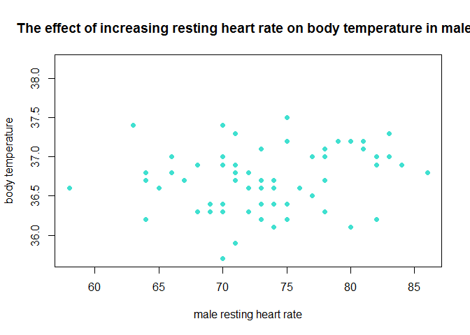
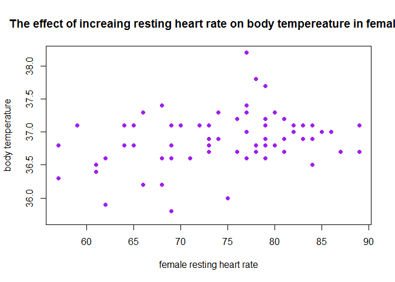
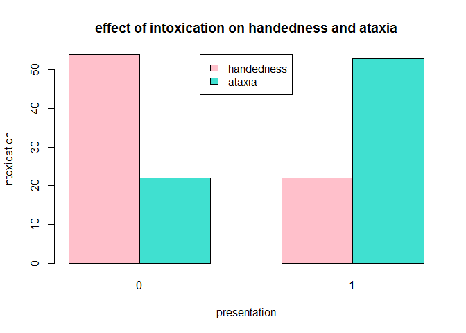
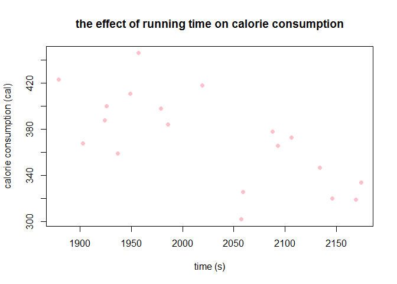

Stats Exam, 31st August 2016
================

Question 1
==========

Null Hypothesis
---------------

-   increasing resting heart rate in males does not have a stronger association with increasing body temperature compared with females

Alternative Hypothesis
----------------------

-   increasing resting heart rate in males has a stronger association with increasing body temperature compared with females

``` r
# read the data
x <- read.csv("file:///C:/Users/Wits-User/Desktop/Stats Exam 2016/question1.csv")

#plot the data for male heart rate vs body temperature
plot(x$male,x$body_temperature, main = 'The effect of increasing resting heart rate on body temperature in males', ylab = 'body temperature', xlab = 'male resting heart rate', pch = 19, col = "turquoise")
abline(lm(x$male~x$body_temperature, data = x), lwd = 3, col = "black")
```



``` r
# linear regression
x1 <- lm(x$male~x$body_temperature, data = x)
summary(x1)
```

    ## 
    ## Call:
    ## lm(formula = x$male ~ x$body_temperature, data = x)
    ## 
    ## Residuals:
    ##      Min       1Q   Median       3Q      Max 
    ## -15.0099  -3.8644  -0.0162   3.8508  12.4204 
    ## 
    ## Coefficients:
    ##                    Estimate Std. Error t value Pr(>|t|)
    ## (Intercept)         -31.234     68.778  -0.454    0.651
    ## x$body_temperature    2.848      1.873   1.521    0.133
    ## 
    ## Residual standard error: 5.816 on 63 degrees of freedom
    ##   (65 observations deleted due to missingness)
    ## Multiple R-squared:  0.03542,    Adjusted R-squared:  0.02011 
    ## F-statistic: 2.313 on 1 and 63 DF,  p-value: 0.1333

``` r
#plot the data for female heart rate vs temperature
plot (x$female,x$body_temperature, main = 'The effect of increaing resting heart rate on body tempereature in females', ylab = 'body temperature', xlab = 'female resting heart rate', pch = 19, col = "purple")
abline(lm(x$female~x$body_temperature, data = x), lwd = 3, col = "black")
```



``` r
#linear regression
x1 <- lm(x$female~x$body_temperature, data = x)
summary(x1)
```

    ## 
    ## Call:
    ## lm(formula = x$female ~ x$body_temperature, data = x)
    ## 
    ## Residuals:
    ##      Min       1Q   Median       3Q      Max 
    ## -16.6562  -4.6562  -0.0026   5.8058  15.9016 
    ## 
    ## Coefficients:
    ##                    Estimate Std. Error t value Pr(>|t|)  
    ## (Intercept)        -131.593     87.516  -1.504   0.1377  
    ## x$body_temperature    5.577      2.372   2.351   0.0219 *
    ## ---
    ## Signif. codes:  0 '***' 0.001 '**' 0.01 '*' 0.05 '.' 0.1 ' ' 1
    ## 
    ## Residual standard error: 7.833 on 63 degrees of freedom
    ##   (65 observations deleted due to missingness)
    ## Multiple R-squared:  0.08066,    Adjusted R-squared:  0.06607 
    ## F-statistic: 5.528 on 1 and 63 DF,  p-value: 0.02186

Test assumptions
----------------

-   linear regression aims to see if there is a linear relationship between the duration of running time and the calories consumped.
-   the data has two variables, therefore, one variable is considered to be independent and the other is considered to be a dependent variable.

Output of statistical test
--------------------------

-   Males: df = 63, p value = 0.1333
-   Females: df = 63, p value = 0.02186

Conclusions
-----------

-   p value for males is more than 0.05 but the p value for females is less than 0.05, therefore reject the alternative hypothesis and accept the null hypothesis.
-   females have a stronger association between resting heart rate and body temperature.

Question 2
==========

Null hypopthesis
----------------

-   intoxicated test subjects do not use their dominant hand and are not subject to ataxic gait.

Alternative hypothesis
----------------------

-   intoxicated individuals use their dominant hand and are subject to ataxic gait.

``` r
# read the data
x <- read.csv("file:///C:/Users/Wits-User/Desktop/Stats Exam 2016/question2.csv")
x1 <- xtabs(~handedness + first_stumble, data = x)
head(x)
```

    ##   id sex handedness first_stumble final_position
    ## 1  1   1          1             1              1
    ## 2  2   1          1             1              1
    ## 3  3   0          1             1              1
    ## 4  4   1          1             1              0
    ## 5  5   1          1             0              0
    ## 6  6   1          0             0              1

``` r
table(x$handedness, x$first_stumble)
```

    ##    
    ##      0  1
    ##   0 54 22
    ##   1 22 53

``` r
#contents of data x
dim(x)
```

    ## [1] 151   5

``` r
names(x)
```

    ## [1] "id"             "sex"            "handedness"     "first_stumble" 
    ## [5] "final_position"

``` r
head(x)
```

    ##   id sex handedness first_stumble final_position
    ## 1  1   1          1             1              1
    ## 2  2   1          1             1              1
    ## 3  3   0          1             1              1
    ## 4  4   1          1             1              0
    ## 5  5   1          1             0              0
    ## 6  6   1          0             0              1

``` r
tail(x)
```

    ##      id sex handedness first_stumble final_position
    ## 146 146   0          1             1              1
    ## 147 147   0          0             0              1
    ## 148 148   1          0             0              0
    ## 149 149   1          0             1              0
    ## 150 150   0          0             0              0
    ## 151 151   0          0             0              0

``` r
summary(x)
```

    ##        id             sex           handedness     first_stumble   
    ##  Min.   :  1.0   Min.   :0.0000   Min.   :0.0000   Min.   :0.0000  
    ##  1st Qu.: 38.5   1st Qu.:0.0000   1st Qu.:0.0000   1st Qu.:0.0000  
    ##  Median : 76.0   Median :0.0000   Median :0.0000   Median :0.0000  
    ##  Mean   : 76.0   Mean   :0.4503   Mean   :0.4967   Mean   :0.4967  
    ##  3rd Qu.:113.5   3rd Qu.:1.0000   3rd Qu.:1.0000   3rd Qu.:1.0000  
    ##  Max.   :151.0   Max.   :1.0000   Max.   :1.0000   Max.   :1.0000  
    ##  final_position  
    ##  Min.   :0.0000  
    ##  1st Qu.:0.0000  
    ##  Median :1.0000  
    ##  Mean   :0.5563  
    ##  3rd Qu.:1.0000  
    ##  Max.   :1.0000

``` r
#plot the data

barplot(x1, beside = TRUE, ylab = 'intoxication', xlab= 'presentation', main = 'effect of intoxication on handedness and ataxia', col= c("pink", "turquoise"))

legend('top', c("handedness", "ataxia"), fill = c("pink", "turquoise"))
```



``` r
# statistical test
z <- chisq.test(x1, correct = TRUE)
z
```

    ## 
    ##  Pearson's Chi-squared test with Yates' continuity correction
    ## 
    ## data:  x1
    ## X-squared = 24.639, df = 1, p-value = 6.913e-07

Test assumption
---------------

-   the data is categorical but from the same population
-   the aim of the exercise is to see if there is an association between the variables with intoxication

Output of the statistical test
------------------------------

-   df = 1, p value &lt; 0.05

Conclusion
----------

-   Alcohol consumption causes ataxia and more dependence on dominant hand

Question 3
==========

Null hypothesis
---------------

-   The number of calories consumed does not depend on running time

Alternative hypothesis
----------------------

-   The number of calories consumed depends on running time

``` r
# read the data
x <- read.csv("file:///C:/Users/Wits-User/Desktop/Stats Exam 2016/question3.csv")

#tidy the data
time = x$time
calories = x$calories
head(cbind(time,calories))
```

    ##      time calories
    ## [1,] 2169      319
    ## [2,] 1986      384
    ## [3,] 1979      398
    ## [4,] 1937      359
    ## [5,] 2093      366
    ## [6,] 1924      388

``` r
#plot the data
plot(x$time,x$calories, main = 'the effect of running time on calorie consumption', xlab = 'time (s)', ylab = 'calorie consumption (cal)', pch = 19, col = "pink")
abline(lm(x$time ~ x$calories, data = x), col = "purple", lwd = 3)
```



``` r
#linear regression
x1 <- lm(x$time~x$calories, data = x)
summary(x1)
```

    ## 
    ## Call:
    ## lm(formula = x$time ~ x$calories, data = x)
    ## 
    ## Residuals:
    ##      Min       1Q   Median       3Q      Max 
    ## -128.343  -58.148   -3.588   63.468   87.402 
    ## 
    ## Coefficients:
    ##              Estimate Std. Error t value Pr(>|t|)    
    ## (Intercept) 2629.4011   160.9786  16.334 7.95e-12 ***
    ## x$calories    -1.6252     0.4309  -3.772  0.00152 ** 
    ## ---
    ## Signif. codes:  0 '***' 0.001 '**' 0.01 '*' 0.05 '.' 0.1 ' ' 1
    ## 
    ## Residual standard error: 72.65 on 17 degrees of freedom
    ## Multiple R-squared:  0.4556, Adjusted R-squared:  0.4235 
    ## F-statistic: 14.22 on 1 and 17 DF,  p-value: 0.001522

prediction of calories consumed if running time is reduced to 30 minutes
------------------------------------------------------------------------

-   460 calories

Test assumptions
----------------

-   linear regression aims to see if there is a linear relationship between the duration of running time and the calories consumped.
-   the data has two variables, therefore, one variable is considered to be independent and the other is considered to be a dependent variable.

Output of the statistical test
------------------------------

-   p value: 0.001522, df: 17

Conclusion
----------

-   p value&lt; 0.05 therefore reject the null hypothesis and accept the alternative hypothesis.
-   there is a linear relationship between the two variables, therefore calorie consumption depends on the duration of running time.

Question 4
==========
